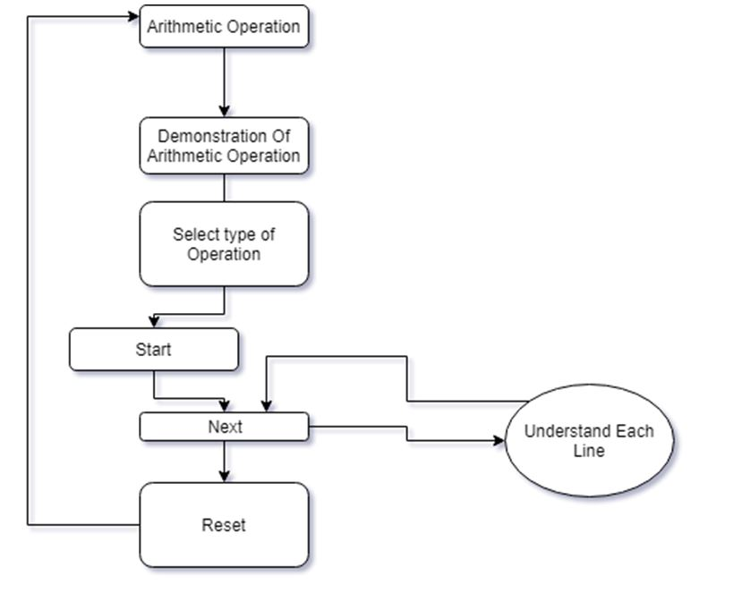
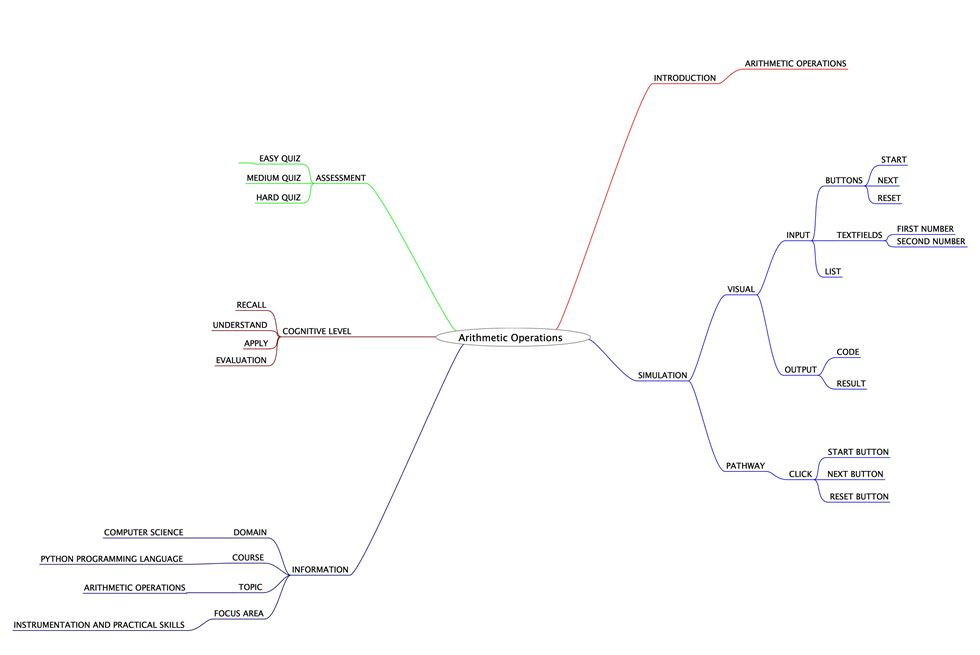
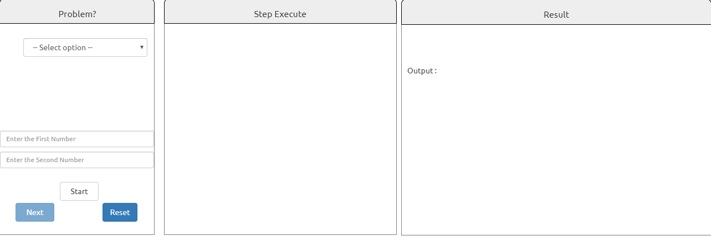

# Round 2

**Experiment 1: Arithmetic Operations**

### 1. Story Outline :

 The experiment involves the use of python simulator implementing various arithmetic operations. Performing arithmetic operations on large numbers can be a difficult job to accomplish. This difficulty can be countered with the help of python simulator that provides a friendly programming environment to the beginners, so that every new user can easily perform arithmetic operations and can implement in various python programs.  

### 2. Story :

#### 2.1 Set the Visual Stage Description:

<h2>Construction of the set-up:</h2>

For better visualization, the simulator is divided into three sections: 
 Input Section: Helps in interacting with the user (accepting numbers as inputs).
 Code Section: Displays the subsequent code for each type of choice the user takes to perform any operation.
 Output Section: Displays the output that will be generated after the code runs successfully.

#### 2.2 Set User Objectives & Goals:

| Sr. No | Learning Objective                                                                                                                              | Cognitive Level | Action Verb |
| :----- | :---------------------------------------------------------------------------------------------------------------------------------------------- | :-------------- | :---------: |
| 1.     | User will be able to:  recall the various arithmetic operations.                                                                             | Recall          |  Identify   |
| 2.     | User will be able to:  understand the types of arithmetic operators in Python language  and how to perform various arithmetic operations. | Understand      |  Describe   |
| 3.     | User will be able to:  implement/use arithmetic operators on input values in Python programs.                                                | Apply           |  Implement  |
| 4.     | User will be able to:  take the assignment to evaluate what they learnt and enhance his capabilities.                                        | Analyze         |   Examine   |

Enhance conceptual and logical skill
</b>

#### 2.3 Set the Pathway Activities:

The simulator tab would allow:   

<dd> 1.	The setup consists of a simulator that helps in performing arithmetic operations with the use of python interpreter.
2.	Additionally, there will be three sections to work upon: Input Section, Code Section and Output Section.
3.	The code section will display the python code for the type of operation you want to perform.
4.	Once the experiment has been performed, you can take the quiz.

</dd>

##### 2.4 Set Challenges and Questions/Complexity/Variations in Questions:

Assessment Questions: 

<dd><b> 1. Arithmetic operators are usually- 
a.	Unary 
b.	Binary 
c.	Ternary 
d.	None of the Above </dd> </b> 
<dd><b>2.	Which of the following can be operands of arithmetic operators? 
a.	Numeric 
b.	Boolean 
c.	Characters 
d.	Both a & c
  </b>
<dd>
<b> 3.	What is the output of the following code? 
print((a+b)*d-c)
a)	10 
b)	-270 
c)	23 
d)	None of the above </b>
</dd>

##### 2.6 Conclusion:

<dd>The python interpreter has a number of arithmetic operations. They are loaded automatically as the interpreter starts and are always available. Thus, it makes it easier for a programmer to perform small but complex operations with ease.
</dd>

##### 2.7 Equations/formulas: NA

### 3. Flowchart

### 4. Mindmap

 
### 5. Storyboard 

