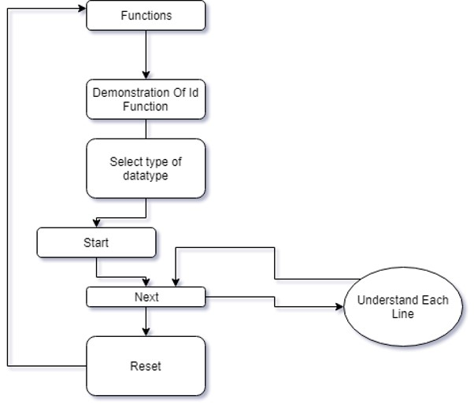
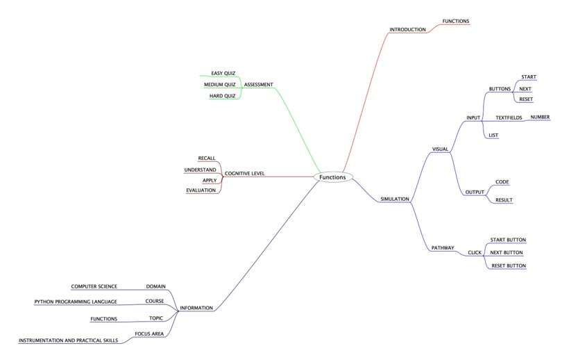

## Round 2

Experiment 2: Functions

### 1. Story Outline:

 The experiment involves the use of python simulator implementing various in-built functions in python programming. An executable program may contain many lines which occupies more memory. This difficulty can be countered with the help of python in-built functions that save sour time and memory. Python simulator provides a programming environment to the beginners, so that every new user can easily implement in-built functions in various python programs.

### 2. Story:

#### 2.1 Set the Visual Stage Description:
<h2>Construction of the set-up</h2>

For better visualization, a simulator is provided. A simulation can always act as the best possible alternative to learn. the simulator is divided into three sections:  
➢	Input Section: Helps in interacting with the user (accepting function-name and return-type as inputs). 
➢	Code Section: Displays the subsequent function module or code for each type of choice the user takes to implement functions. 
➢	Output Section: Displays the output that will be generated after the code runs successfully.

#### 2.2 Set User Objectives & Goals:

Sr. No |	Learning Objective	| Cognitive Level | Action Verb
:--|:--|:--|:-:
1.| User will be able to:  understand the pre-defined or built-in functions used in python programming language | Understand | Describe
2.| User will be able to:  use the simulator as a Python interpreter.  | Understand| Describe
3.| User will be able to:  enter function-name and id to perform a particular task. | Apply | Implement
4.| User will be able to:  generate the desired output of the previous inputs. | Analyze| Examine

Enhance conceptual and logical skill
</b>

#### 2.3 Set the Pathway Activities:

The simulator tab would allow:   
<dd> 1. The setup consists of a simulator that helps in implementing functions in python programming language with the use of interpreter. 
2. Additionally, there will be three sections to work upon: Input Section, Code Section and Output Section.  
3. The code section will display the python code for the type of function you want to implement. 
4. Once the experiment has been performed, you can take the quiz.

</dd>

##### 2.4 Set Challenges and Questions/Complexity/Variations in Questions:

Assessment Questions: 

<dd><b> 1. What will the function id() return? 
a.	Integer Value 
b.	Character 
c.	String 
d.	All of the Above </dd> </b> 
<dd><b>2. Which of the following keywords make the begining of the function block? 
a.	fun 
b.	define 
c.	def 
d.	function
  </b>
<dd>
<b> 3. Which of the following items are present in the function header? 
a)	Function name 
b)	Parameter list 
c)	Return type 
d)	Both a & b </b>
</dd>
<dd>
<b>4.	What is the output of the following code?  
N=1
def func():
     N=3
     print(N)
func()
print(n)
a)	1 3 
b)	3 3 
c)	3 1 
d)	Runtime Error </b>
</dd>

##### 2.6 Conclusion:
<dd>The python interpreter has a number of in-built or pre-defined functions. They are loaded automatically as the interpreter starts and are always available. Thus, it makes it easier for a programmer to implement functions and perform complex tasks with ease.
</dd>

##### 2.7 Equations/formulas: NA

### 3. Flowchart

### 4. Mindmap

 
### 5. Storyboard 

