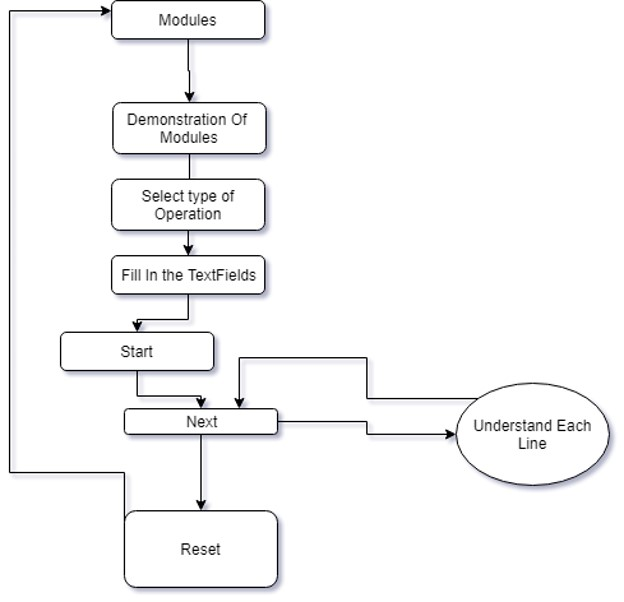
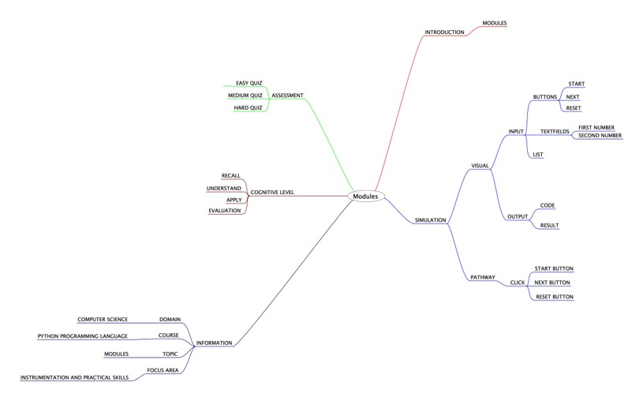
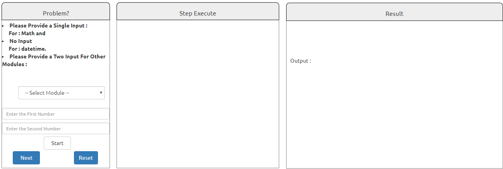

## Round 2

Experiment 3: Modules

### 1. Story Outline:

 The experiment involves the use of a simulator which is equivalent to a python interpreter. Learning a programming language all by one-self can be difficult job to accomplish. This difficulty can be countered with the help of a simulator that provides a beginner friendly programming environment, so that every new user can easily understand about built-in modules and can implement in various python programs.

### 2. Story:

#### 2.1 Set the Visual Stage Description:
<h2>Construction of the set-up</h2>

For better visualization, the simulator is divided into three sections. First, the input section which interacts with the user. Second, the code section which displays the subsequent code for each type of choice the user takes. And third, the output section which displays the output that will be generated after the code runs successfully. 

#### 2.2 Set User Objectives & Goals:

Sr. No |	Learning Objective	| Cognitive Level | Action Verb
:--|:--|:--|:-:
1.| User will be able to:  understand the use of built-in modules. | Understand | Describe
2.| User will be able to:  use the simulator as a python interpreter. | Understand| Describe
3.| User will be able to:  enter values that can be operated upon using built-in modules. | Apply | Implement
4.| User will be able to:  Generate the output of the previously generated python code. | Analyze| Examine

Enhance conceptual and logical skill
</b>

#### 2.3 Set the Pathway Activities:

The simulator tab would allow:   
<dd>1.	The set-up consist of a simulator that replicates the use of a python interpreter.  
2.	Additionally there will be three sections to work upon. Input section, code section and output section. 
3.	The code section will display the python code for the type of module you want to use. 
4.	Once the experiment has been performed, you can take the quiz.  

</dd>

##### 2.4 Set Challenges and Questions/Complexity/Variations in Questions:

Assessment Questions: 

<dd><b> 1.	What is the use of datetime module? 
a.	To provide IST. 
b.	To provide system date and time. 
c.	To perform matrix multiplication. 
d.	None of these </dd> </b> 
<dd><b>2.	Which one is the following is used to find square root of a number? 
a.	math.underroot() 
b.	math.root() 
c.	math.sqrt() 
d.	None of these 
  </b>
<dd>
<b> 3.	Which module is used to get a random number? 
a.  rand() 
b.	rand_int() 
c.	random() 
d.  None of these 
 </b>
</dd>

##### 2.6 Conclusion:
<dd>The Python interpreter has a number of built-in modules. They are loaded automatically as the interpreter starts and are always available. Thus, it makes it easier for a programmer to perform small but complex operations with ease.
</dd>

##### 2.7 Equations/formulas: NA

### 3. Flowchart

### 4. Mindmap

  
### 5. Storyboard 

