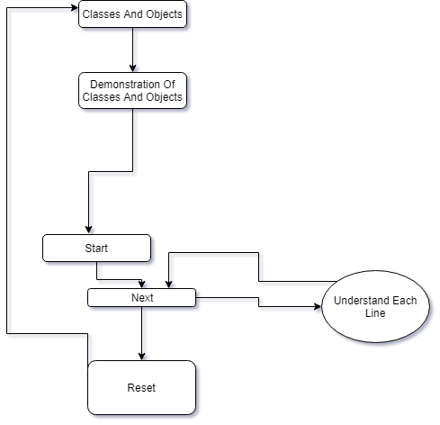
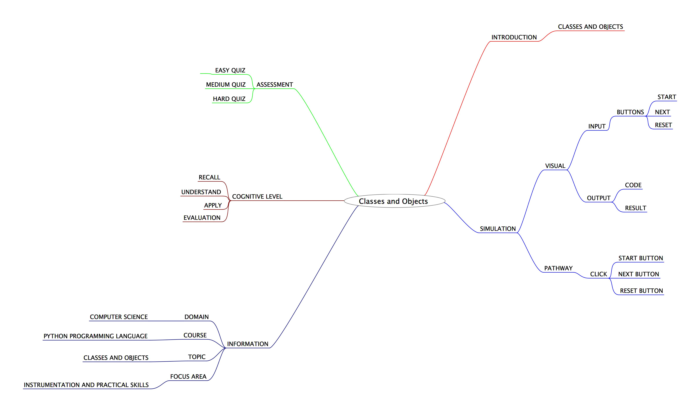
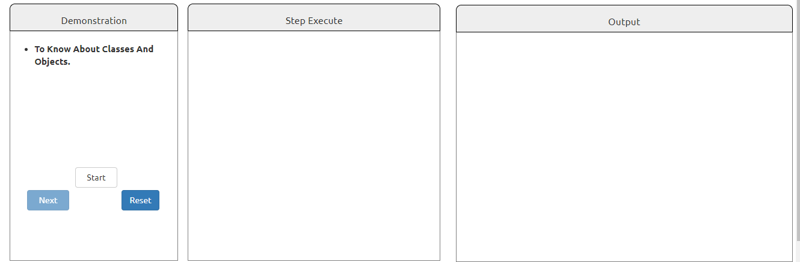

## Round 2

Experiment 6: : Class and Objects

### 1. Story Outline:

 Here, the experiment involves the use of python simulator for implementing class and objects related operations. Python has been an object-oriented language since it existed. Because of this, creating and using classes and objects are downright easy. This concept can be countered with the help of python simulator that provides a friendly programming environment to the beginners; so that every new user can easily perform operations related to class and objects .

### 2. Story:

#### 2.1 Set the Visual Stage Description:

<h2>Construction of the Set-up</h2>

For better visualization, a simulator is divided into three aections.  
➢ Input Section: Helps in interacting with the user (accepting numbers as inputs). 
➢ Code Section: Displays the subsequent code for each type of choice the user takes to perform any operation. 
➢ Output Section: Displays the output that will be generated after the code runs successfully.

#### 2.2 Set User Objectives & Goals:

| Sr. No | Learning Objective                                                                                       | Cognitive Level | Action Verb |
| :----- | :------------------------------------------------------------------------------------------------------- | :-------------- | :---------: |
| 1.     | User will be able to:  recall the basics of Classes and Objects                                       | Recall          |  Identify   |
| 2.     | User will be able to:  Understand the concepts of objects and classes in Python Programming           | Understand      |  Describe   |
| 3.     | User will be able to:  implement/use arithmetic operators on input values in Python programs.         | Apply           |  Implement  |
| 4.     | User will be able to:  take the assignment to evaluate what they learnt and enhance his capabilities. | Analyze         |   Examine   |

Enhance conceptual and logical skill
</b>

#### 2.3 Set the Pathway Activities:

The simulator tab would allow:   

<dd> 1. The setup consists of a simulator that helps in performing problems related to class and object with the use of python interpreter. 
2. 	Additionally, there will be three sections to work upon: Input Section, Code Section and Output Section. 
3. 	The code section will display the python code for the type of operation you want to perform. 
4. 	Once the experiment has been performed, you can take the quiz.

</dd>

##### 2.4 Set Challenges and Questions/Complexity/Variations in Questions:

Assessment Questions: 

<dd><b> 1. 1.	A variable that can be shared by each and every object of the class. 
a.	Class Variable 
b.	Instance Variable 
c.	Method Variable 
d.	None of the Above </dd> </b> 
<dd><b>2.	Objects is an instance of class which stores variables and functions? 
a.	True 
b.	False 
c.	Maybe 
d.	None of the Above
  </b>
<dd>
<b> 3.  What is the syntax to define class objects : 
a)	Object_name.class_name() 
b)Object_name.class_name[] 
c)Object_name.class_name{} 
d)	None of the Above </b>
</dd>

##### 2.6 Conclusion:

<dd>The python interpreter has a number of operations involving objects and classes.Python programming language provides an objective to learn about the classes and objects with the help of a simple program and to implement it in Python programming language.
</dd>

##### 2.7 Equations/formulas: NA

### 3. Flowchart

### 4. Mindmap

 
### 5. Storyboard 

