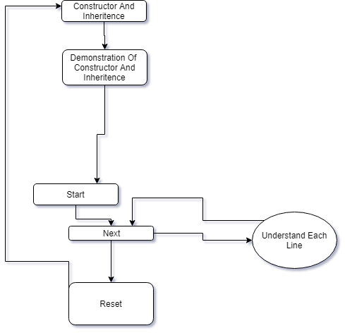
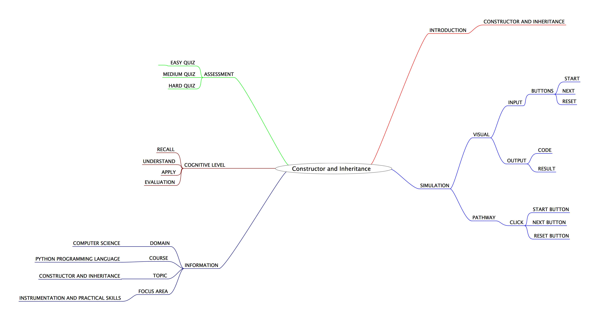
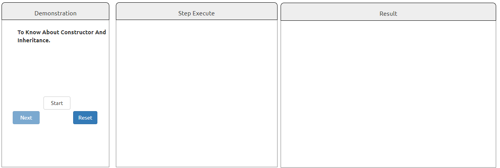

## Round 2

Experiment 8: :Constructor and Inheritance

### 1. Story Outline:

The experiment involves the use of a simulator which is equivalent to a python interpreter. Learning a programming language all by one-self can be difficult job to accomplish. This difficulty can be countered with the help of a simulator that provides a beginner friendly programming environment, so that every new user can easily understand about constructor and inheritance and can implement in various python programs.

### 2. Story:

#### 2.1 Set the Visual Stage Description:

<h2>Construction of the Set-up</h2>

For better visualization, a simulator is divided into three aections.  
➢ Input Section: Helps in interacting with the user (accepting numbers as inputs). 
➢ Code Section: Displays the subsequent code for each type of choice the user takes to perform any operation. 
➢ Output Section: Displays the output that will be generated after the code runs successfully.

#### 2.2 Set User Objectives & Goals:

| Sr. No | Learning Objective                                                                                       | Cognitive Level | Action Verb |
| :----- | :------------------------------------------------------------------------------------------------------- | :-------------- | :---------: |
| 1.     | User will be able to:  recall the basics of constructor and inheritance.                              | Recall          |  Identify   |
| 2.     | User will be able to:  Understand the concepts of constructor and inheritance.in Python Programming   | Understand      |  Describe   |
| 3.     | User will be able to:  implement/use constructor and inheritance on input values in Python programs.  | Apply           |  Implement  |
| 4.     | User will be able to:  take the assignment to evaluate what they learnt and enhance his capabilities. | Analyze         |   Examine   |

Enhance conceptual and logical skill
</b>

#### 2.3 Set the Pathway Activities:

The simulator tab would allow:   

<dd> 1. The setup consists of a simulator that helps in performing problems related to constructor and inheritance with the use of python interpreter. 
2. 	Additionally, there will be three sections to work upon: Input Section, Code Section and Output Section. 
3. 3.	The code section will display the python code that will help in understanding the concepts of constructor and inheritance. 
4. 	Once the experiment has been performed, you can take the quiz.

</dd>

##### 2.4 Set Challenges and Questions/Complexity/Variations in Questions:

Assessment Questions: 

<dd><b> 1. 1.	1.	What is the use of __init__? 
a.  To define a constructor 
b.	To inherit a class. 
c.	To skip an iteration. 
d.	None of the Above </dd> </b> 
<dd><b>2.	2.	What is the following syntax used for:
			class class_name1(class_name2):

a. To inherit a class 
b. To define a class 
c. To define a macro 
d. None of the Above
  </b>

<dd>
<b> 3. 3.	Is it possible to have non parameterized constructors? 
a)	Yes 
b)	No 
c)	Maybe 
d)	None of the Above </b>
</dd>

##### 2.6 Conclusion:

<dd>The Python is an object-oriented language and it allows the use of constructor and inheritance. Inheritance prevents rewriting of the code while constructor aims in providing perform some default operations. Thus, it makes it easier for a programmer to perform some of the complex operations with ease.

</dd>

##### 2.7 Equations/formulas: NA

### 3. Flowchart

### 4. Mindmap

 
### 5. Storyboard 

