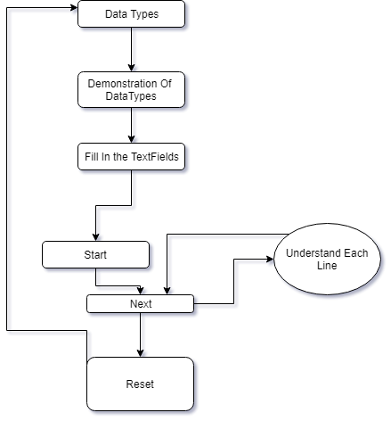
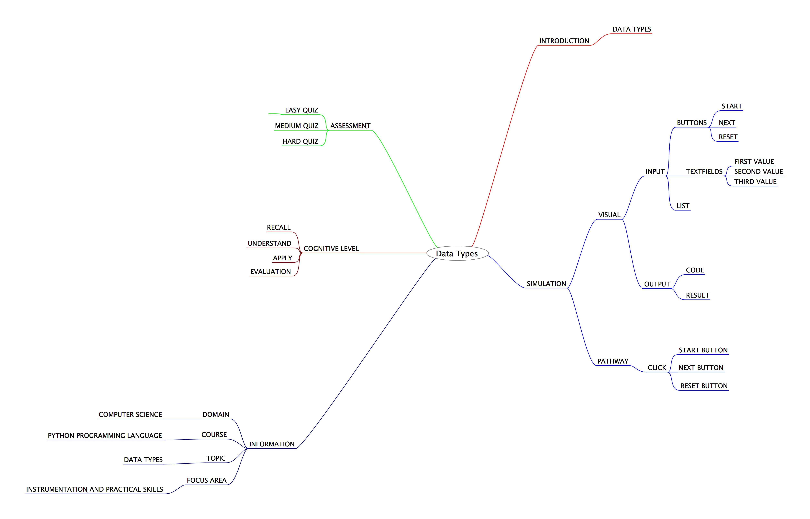
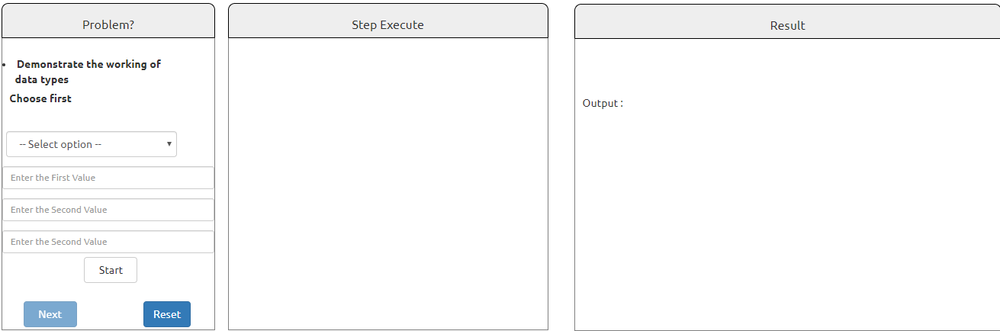

## Round 2

Experiment 4: : Data Types

### 1. Story Outline:

To convey the meaning of the data, a data type is important and everything in Python programming is an object, and each object has its own unique identity (a type and a value). Here, the experiment involves the use of python simulator implementing various data types. Operations related to data types Involves clubbing of data which involves use of array. For which mutability and immutability concept play an important role. This difficulty can be countered with the help of python simulator that provides a friendly programming environment to the beginners; so that every new user can easily perform data type related operations involving the use of list tuples and dictionary.

### 2. Story:

#### 2.1 Set the Visual Stage Description:

<h2>Construction of the Set-up</h2>

For better visualization, a simulator is divided into three sections.  
➢ Input Section: Helps in interacting with the user (accepting numbers as inputs). 
➢ Code Section: Displays the subsequent code for each type of choice the user takes to perform any operation. 
➢ Output Section: Displays the output that will be generated after the code runs successfully.

#### 2.2 Set User Objectives & Goals:

| Sr. No | Learning Objective                                                                                              | Cognitive Level | Action Verb |
| :----- | :-------------------------------------------------------------------------------------------------------------- | :-------------- | :---------: |
| 1.     | User will be able to:  recall the basics of the basics of data types used in python programming.             | Recall          |  Identify   |
| 2.     | User will be able to:  Understand the concepts about the various array types in Python programming language. | Understand      |  Describe   |
| 3.     | User will be able to:  implement/use enter the values that can be operated upon using array.                 | Apply           |  Implement  |
| 4.     | User will be able to:  take the assignment to evaluate what they learnt and enhance his capabilities.        | Analyze         |   Examine   |

Enhance conceptual and logical skill
</b>

#### 2.3 Set the Pathway Activities:

The simulator tab would allow:   

<dd> 1.	The setup consists of a simulator that helps in performing problems related to array types with the use of python interpreter. 
2. 	Additionally, there will be three sections to work upon: Input Section, Code Section and Output Section. 
3. 	The code section will display the python code for the type of operation you want to perform. 
4. 	Once the experiment has been performed, you can take the quiz.

</dd>

##### 2.4 Set Challenges and Questions/Complexity/Variations in Questions:

Assessment Questions: 

<dd><b> 1.	What  are immutable  
a.	Tuples 
b.	List 
c.	Dictionary 
d.	None of the Above </dd> </b> 
<dd><b>2. Which of the following can be an example of list? 
a.	(1,2,3) 
b.	{1,2,3} 
c.	[1,2,3] 
d.	Both a & c
  </b>
<dd>
<b> 3. 	An unordered collection of data type in key value pair form : 
a. Tuples 
b.  List 
c. Dictionary 
d.	None of the Above </b>
</dd>

##### 2.6 Conclusion:

<dd>The python interpreter has a number of data types. They are loaded automatically as the interpreter starts and are always available. Thus, it makes it easier for a programmer to perform small but complex array related operations with ease.
</dd>

##### 2.7 Equations/formulas: NA

### 3. Flowchart

### 4. Mindmap

 
### 5. Storyboard 

