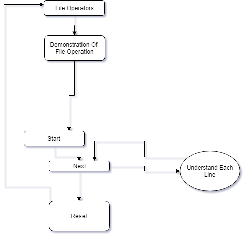
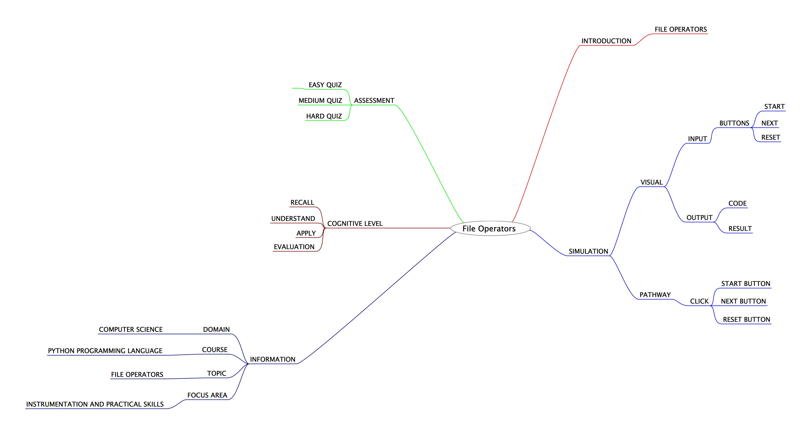
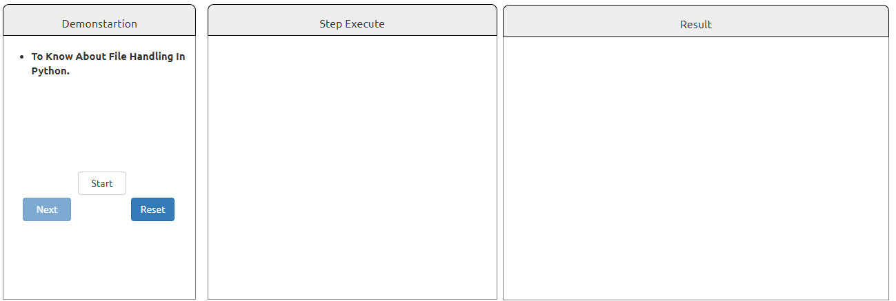

## Round 2

Experiment 9 : File Operators

### 1. Story Outline:

 The experiment involves the use of a simulator which is equivalent to a python interpreter. Learning a programming language all by one-self can be difficult job to accomplish. This difficulty can be countered with the help of a simulator that provides a beginner friendly programming environment, so that every new user can easily understand about file operators and can implement in various python programs.

### 2. Story:

#### 2.1 Set the Visual Stage Description:

<h2>Construction of the Set-up</h2>

For better visualization, a simulator is divided into three aections.  
➢ Input Section: Helps in interacting with the user (accepting numbers as inputs). 
➢ Code Section: Displays the subsequent code for each type of choice the user takes to perform any operation. 
➢ Output Section: Displays the output that will be generated after the code runs successfully.

#### 2.2 Set User Objectives & Goals:

| Sr. No | Learning Objective                                                                                       | Cognitive Level | Action Verb |
| :----- | :------------------------------------------------------------------------------------------------------- | :-------------- | :---------: |
| 1.     | User will be able to:  recall the basics of File Operators                                            | Recall          |  Identify   |
| 2.     | User will be able to:  Understand the concepts of file operators in Python Programming                | Understand      |  Describe   |
| 3.     | User will be able to:  Understand a code for file operators                                           | Understand      |  Implement  |
| 4.     | User will be able to:  take the assignment to evaluate what they learnt and enhance his capabilities. | Analyze         |   Examine   |

Enhance conceptual and logical skill
</b>

#### 2.3 Set the Pathway Activities:

The simulator tab would allow:   

<dd> 1.1.	The set-up consist of a simulator that replicates the use of a python interpreter. 
2. 	2.	Additionally there will be three sections to work upon. Input section, code section and output section. 
3. 	3.	The code section will display the python code demonstrating file handling. 
4. 	Once the experiment has been performed, you can take the quiz.

</dd>

##### 2.4 Set Challenges and Questions/Complexity/Variations in Questions:

Assessment Questions: 

<dd><b> 1. 1.	1.	Which of these is not a file opening mode? 
a.	Read 
b.	Write 
c.	Append 
d.	None of the Above </dd> </b> 
<dd><b>2.	2.	Can a file be created using Write opening mode? 
a.	Yes 
b.	No 
c.	Maybe 
d.	None of the Above
  </b>
<dd>
<b> 3.  What is the syntax to define class objects : 
a)	Yes 
b)	No 
c)	Maybe 
d)	None of these </b>
</dd>

##### 2.6 Conclusion:

<dd>The Python language supports file handling and has a number of file operators. They can be used to either create, read, write or append a file. Thus, it makes it easier for a programmer to handle files directly by writing a code in Python.
</dd>

##### 2.7 Equations/formulas: NA

### 3. Flowchart

### 4. Mindmap

 
### 5. Storyboard 

