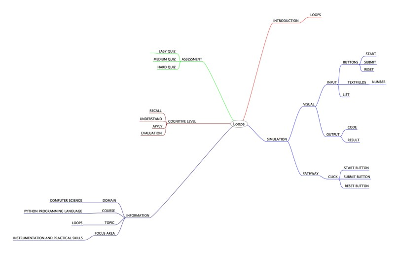

## Round 2

Experiment 3: Loops

### 1. Story Outline:

 The experiment involves the use of python simulator implementing the concept of loops in python programming. An executable program may contain many lines which are called again and again. This difficulty can be countered with the help of loop control methods. Python simulator provides a programming environment to the beginners, so that every new user can easily implement and learn about the flow of control of loops in various python programs.

### 2. Story:

#### 2.1 Set the Visual Stage Description:
<h2>Construction of the set-up</h2>

For better visualization, the simulator is divided into three sections: 
➢	Input Section: Helps in interacting with the user (accepting loop variable and number as input). 
➢	Code Section: Displays the subsequent loop functioning or code for each type of choice the user takes to understand loop concepts. 
➢	Output Section: Displays the output that will be generated after the code runs successfully. 

#### 2.2 Set User Objectives & Goals:

Sr. No |	Learning Objective	| Cognitive Level | Action Verb
:--|:--|:--|:-:
1.| User will be able to:  understand the types of loops used in python programming. | Understand | Describe
2.| User will be able to:  understand the working and flow of loops. | Understand| Describe
3.| User will be able to:  enter range and condition to perform various tasks. | Apply | Implement
4.| User will be able to:  implement the use of loop control methods. | Analyze| Examine

Enhance conceptual and logical skill
</b>

#### 2.3 Set the Pathway Activities:

The simulator tab would allow:   
<dd>➢	The setup consists of a simulator that helps in implementing functions in python programming language with the use of interpreter.  
 ➢	Additionally, there will be three sections to work upon: Input Section, Code Section and Output Section. 
➢	The code section will display the python code for the type of loop you want to implement.  
➢	Once the experiment has been performed, you can take the quiz.  

</dd>

##### 2.4 Set Challenges and Questions/Complexity/Variations in Questions:

Assessment Questions: 

<dd><b> 1.	What is the output of the following code? 
i=2
while True:
           if i%3==0:
                 break
           print(i)
           i=i+2
 
a.	2 4 6 8 10 ... 
b.	2 4 
c.  2 3 
d.	error </dd> </b> 
<dd><b>2.	What is the output of the following code? 
i=1
for i in range(5):
             print(i+1)
             break

 
a.	1 2 3 4 5 
b.	2 
c.  2 4 
d.	1 3 5 
  </b>
<dd>
<b> 3.	What is the output of the following code? 
t=2;
for i in t:
       print(i)
       i=i+1

 
a.	1 2  
b.	1 2 3 
c. Error 
d. 0 1 2 
 </b>
</dd>

##### 2.6 Conclusion:
<dd>The python interpreter consists of two types of loops (while and for). They are loaded automatically as the interpreter starts and are always available. Thus, it makes it easier for a programmer to implement loop control statements and perform complex tasks with ease.
</dd>

##### 2.7 Equations/formulas: NA

### 3. Flowchart

### 4. Mindmap

  
### 5. Storyboard 

