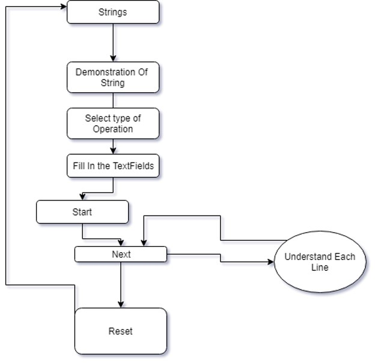
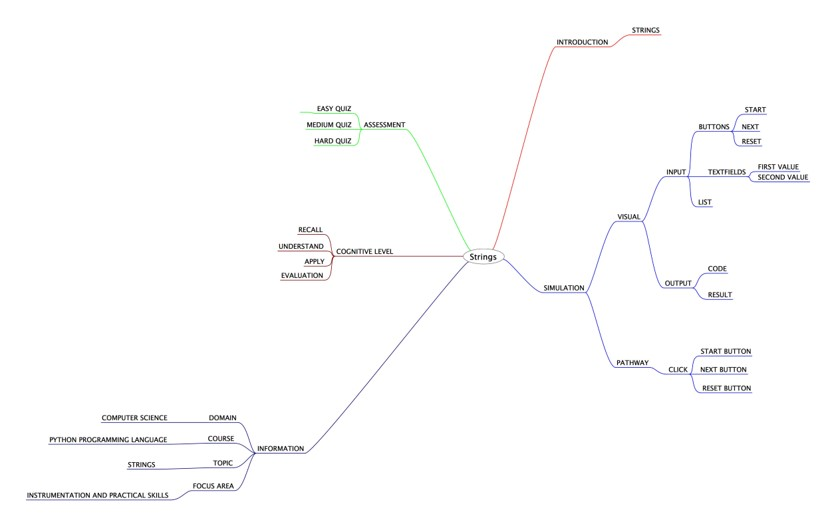
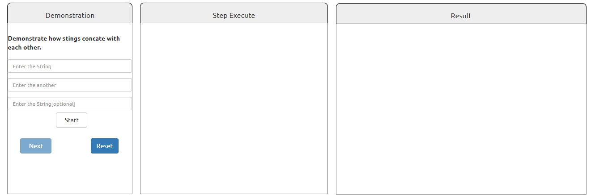

## Round 2

Experiment 5: String

### 1. Story Outline:

 Here, the experiment involves the use of python simulator implementing String related operartions. A string is usually a bit of text in programming that is written to be displayed to users. It is known to Python when you want to display a string. This is because programmers use either double quote " or single quote ' to enclose a word or group of words to express a string. This concept can be countered with the help of python simulator that provides a friendly programming environment to the beginners; so that every new user can easily perform string related operations .

### 2. Story:

#### 2.1 Set the Visual Stage Description:
<h2>Construction of the set-up</h2>
For better visualization, the simulator is divided into three sections: 
➢	Input Section: Helps in interacting with the user (accepting numbers as inputs). 
➢	Code Section: Displays the subsequent code for each type of choice the user takes to perform any operation. 
➢	Output Section: Displays the output that will be generated after the code runs successfully.
 

#### 2.2 Set User Objectives & Goals:

Sr. No |	Learning Objective	| Cognitive Level | Action Verb
:--|:--|:--|:-:
1.| User will be able to:  understand the basics of strings used in python programming. | Understand | Describe
2.| User will be able to:  learn about the various string manipulations that are allowed in Python programming language. | Understand| Describe
3.| User will be able to:  enter the values that can be operated upon using strings. | Apply | Implement
4.| User will be able to:  generate the desired output of the previous inputs. | Analyze| Examine

Enhance conceptual and logical skill
</b>

#### 2.3 Set the Pathway Activities:

The simulator tab would allow:   
<dd>1. The setup consists of a simulator that helps in performing problems related to string with the use of python interpreter.  
2.	Additionally, there will be three sections to work upon: Input Section, Code Section and Output Section. 
3.	The code section will display the python code for the type of operation you want to perform. 
4.	Once the experiment has been performed, you can take the quiz. 

</dd>

##### 2.4 Set Challenges and Questions/Complexity/Variations in Questions:

Assessment Questions: 

<dd><b> 1.	What  are immutable? 
a.	String 
b.	List 
c.	Dictionary 
d.	None of the above </dd> </b> 
<dd><b>2.	Which of the following can be an example of string? 
a.	"123" 
b.	"abc" 
c.	'abc' 
d.	Both b & c 
  </b>
<dd>
<b> 3.	What will be the output of k*5 : 
a.  kkkkk 
b.	k 
    k 
    k 
    k 
    k 
c.	Error 
d.  None of the above 
 </b>
</dd>

##### 2.6 Conclusion:
<dd>The python interpreter has a number of operations involving strings. . Python programming language provides you many operations that can be performed on a string like concatenation, slicing, multiplication etc.
</dd>

##### 2.7 Equations/formulas: NA

### 3. Flowchart

### 4. Mindmap

  
### 5. Storyboard 

